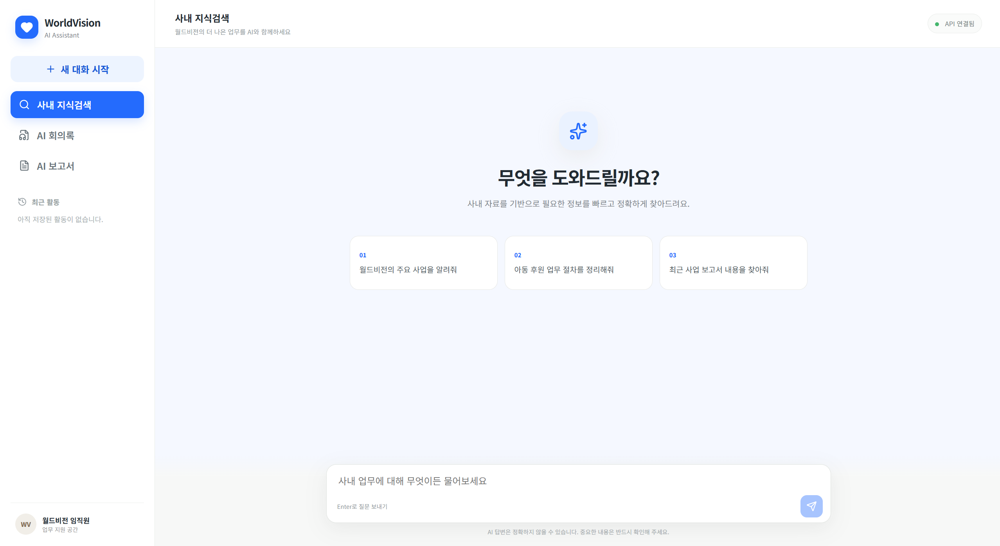
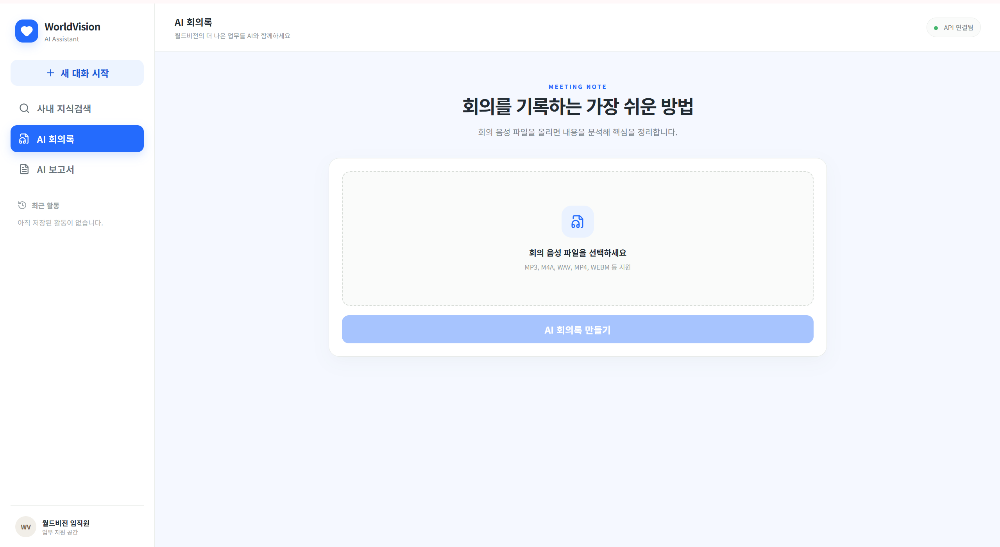
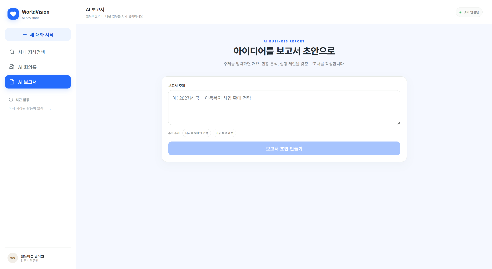

👉 [WorldVision AI Assistant 바로가기](https://worldvision-ai-371850336678.asia-northeast3.run.app/docs)
현재 테스트 배포 버전이며, 최종 배포 완료 후 서비스 URL로 업데이트 예정입니다.

# 🌍 WorldVision AI Assistant (월드비전 AI 어시스턴트)

---

## 📌 1. 프로젝트 소개
* **서비스명**: 월드비전 AI 어시스턴트 (WorldVision AI Assistant API)
* **목적**: 
  * 사내 문서 기반의 정확한 정보 제공 (지식검색 RAG)
  * 회의 음성 파일의 자동 텍스트 변환 및 주요 안건/결정사항 요약 (AI 회의록)
  * 백엔드 API 중심의 확장성 있는 AI 에이전트 구조 설계

---

## 👥 2. 팀원 및 역할 분담

| 이름 | 역할 | 담당 업무 |
| :---: | :---: | :--- |
| **이수빈** | 프로젝트 오너 | • 전체 프로젝트 일정 및 리소스 관리<br>• 서비스 요구사항 정의 및 최종 결과물 검수 |
| **김가연** | AI 솔루션 아키텍트 | • 시스템 전체 AI 백엔드/서비스 아키텍처 설계<br>• 데이터 흐름 및 파이프라인 구조화 |
| **유고은** | AI 엔지니어 | • FastAPI 기반 RESTful API 설계 및 연동<br>• LangChain / OpenAI 활용 핵심 서비스 모듈 개발<br>• RAG 지식검색 및 Whisper STT 회의록 변환 기능 구현 |
| **김은채** | AI 데이터 사이언티스트 | • 서비스 입출력 데이터 전처리 및 품질 검증<br>• RAG 텍스트 임베딩 데이터셋 구성 및 프롬프트 최적화 |
| **정예은** | 클라우드 엔지니어 | • 개발 및 배포 환경(Environment) 설정<br>• 의존성 관리, 서버 파이프라인 및 가상환경 안정화 |

---

## 🛠️ 3. 기술 스택 (Tech Stack)

* **Language**: Python 3.14
* **Package Manager**: `uv`
* **Framework**: FastAPI, Uvicorn
* **AI & LLM**: LangChain, LangGraph, OpenAI API (GPT-4o / GPT-4o-mini, Whisper STT)
* **Database / Vector Search**: PostgreSQL, `pgvector`
* **Monitoring / Tracing**: Langfuse

---

## 🔥 4. 주요 기능 설명

### 1) 🔍 사내 지식검색 API (`/api/v1/search`)
* PostgreSQL/pgvector 기반 RAG 지식검색 및 사내 문서 기반 답변 생성
* Vector Search와 Keyword Search를 결합한 Hybrid Retrieval 적용
* Source/Page Metadata 기반 동일 페이지 Chunk 조회 및 Reranking을 통한 검색 정확도 개선
* 답변과 함께 참고 문서의 출처(Source) 제공

### 2) 📝 AI 회의록 작성 API (`/api/v1/minutes`)
* 회의 음성 파일(mp3, m4a 등) 업로드 및 Whisper 기반 STT 수행
* 회의 요약, 주요 논의사항, 결정사항을 구조화하여 자동 생성
* 업로드된 회의 내용을 기반으로 AI 회의록 생성

### 3) 📊 AI 보고서 생성 API (`/api/v1/report`)
* 사용자가 입력한 주제를 기반으로 AI 보고서 초안 생성
* 보고서 제목, 요약 및 본문을 구조화하여 제공

### 4) 🤖 LangGraph 기반 AI Agent
* LangGraph를 활용하여 사용자 요청에 따라 지식검색, 회의록, 보고서 기능으로 자동 라우팅
* 기능별 서비스 모듈을 하나의 Agent Workflow로 통합

### 5) 🧠 대화 Memory
* Session 기반 대화 History 관리
* Semantic Memory를 활용하여 이전 대화의 관련 정보를 검색하고 답변 Context에 반영

### 6) 📈 Langfuse 모니터링
* Langfuse를 활용한 AI 요청 및 실행 과정 Tracing
* RAG 검색 및 Agent Workflow의 실행 흐름 모니터링

## 📸 5. 데모 화면

WorldVision AI Assistant는 **사내 지식검색, AI 회의록 작성, AI 보고서 생성** 기능을 하나의 웹 인터페이스에서 제공합니다.

### 🔍 사내 지식검색
사내 문서를 기반으로 사용자의 질문과 관련된 정보를 검색하고, 출처를 기반으로 답변을 생성합니다.



### 📝 AI 회의록
회의 음성 파일을 업로드하면 STT를 통해 내용을 변환하고, 주요 논의사항과 결정사항을 구조화된 회의록으로 생성합니다.



### 📊 AI 보고서
사용자가 보고서 주제를 입력하면 관련 내용을 바탕으로 구조화된 보고서 초안을 생성합니다.




## 🚀 6. 실행 방법 (Local Run)

### 1) 프로젝트 설치

저장소를 Clone한 후 프로젝트 디렉터리로 이동합니다.

```bash
git clone <repository-url>
cd worldvision_ai_integration
```

`uv`를 사용하여 백엔드 의존성을 설치합니다.

```bash
uv sync
```

---

### 2) 백엔드 환경 변수 설정

프로젝트 최상위 경로에 `.env` 파일을 생성하고 아래 환경 변수를 설정합니다.

```env
# OpenAI
OPENAI_API_KEY=your_openai_api_key

# PostgreSQL / pgvector
DATABASE_URL=your_database_url

# Langfuse
LANGFUSE_PUBLIC_KEY=your_langfuse_public_key
LANGFUSE_SECRET_KEY=your_langfuse_secret_key
LANGFUSE_HOST=your_langfuse_host
```

| 환경 변수 | 설명 |
| :--- | :--- |
| `OPENAI_API_KEY` | OpenAI LLM 및 Embedding API 사용 |
| `DATABASE_URL` | PostgreSQL/pgvector 데이터베이스 연결 |
| `LANGFUSE_PUBLIC_KEY` | Langfuse 프로젝트 연결 |
| `LANGFUSE_SECRET_KEY` | Langfuse 인증 |
| `LANGFUSE_HOST` | Langfuse 서버 주소 |

> ⚠️ `.env` 파일에는 API Key 및 데이터베이스 접속 정보와 같은 민감한 정보가 포함되므로 Git에 커밋하지 말아주세요.

---

### 3) 프론트엔드 환경 변수 설정

`frontend` 디렉터리에 `.env` 파일을 생성하고 아래 환경 변수를 설정합니다.

```env
VITE_API_BASE_URL=
VITE_PROXY_TARGET=http://localhost:8000
```

| 환경 변수 | 설명 |
| :--- | :--- |
| `VITE_API_BASE_URL` | 프론트엔드에서 사용할 백엔드 API 기본 주소 |
| `VITE_PROXY_TARGET` | 로컬 개발 환경에서 API 요청을 전달할 백엔드 서버 주소 |

로컬 개발 환경에서는 Vite Proxy를 통해 `http://localhost:8000`에서 실행 중인 백엔드로 API 요청을 전달합니다.

---

### 4) 백엔드 서버 실행

프로젝트 루트에서 다음 명령어를 실행합니다.

```bash
uv run uvicorn worldvision_ai_project.main:app --reload
```

서버 실행 후 Swagger UI에서 API를 확인할 수 있습니다.

```text
http://127.0.0.1:8000/docs
```

---

### 5) 프론트엔드 실행

새 터미널을 열고 `frontend` 디렉터리로 이동합니다.

```bash
cd frontend
```

프론트엔드 패키지를 설치합니다.

```bash
npm install
```

개발 서버를 실행합니다.

```bash
npm run dev
```

실행 후 터미널에 표시되는 Local URL을 통해 서비스 화면에 접속할 수 있습니다.

---

### 6) 테스트 실행

프로젝트 루트에서 다음 명령어를 실행하여 API 및 LangGraph Agent 테스트를 수행할 수 있습니다.

## 🏗️ 7. 시스템 아키텍처

WorldVision AI Assistant는 **FastAPI 기반 API Layer**, **LangGraph 기반 Agent**, 기능별 **AI Service**, 그리고 **PostgreSQL + pgvector 기반 Data Layer**로 구성되어 있습니다.

### 전체 처리 흐름

```text
User
  ↓
Frontend (React)
  ↓
FastAPI + Pydantic
  │
  │  Request / Response Schema Validation
  ↓
LangGraph Agent
  │
  ├── Knowledge Search
  │       ↓
  │    Hybrid Retrieval
  │    (Vector Search + Keyword Search)
  │       ↓
  │    Source / Page 기반 관련 Chunk 확장
  │       ↓
  │    Reranking
  │       ↓
  │    LLM Answer Generation
  │
  ├── Meeting Minutes
  │       ↓
  │    Whisper STT → LLM 구조화
  │
  └── Report Generation
          ↓
       LLM 기반 보고서 생성

        ↕
PostgreSQL + pgvector
        ↕
Session Memory

Langfuse → Agent / LLM / RAG Trace Monitoring
```

### RAG 검색 구조

사내 지식검색은 단순 Vector Search만 사용하는 방식에서 확장하여, 검색 정확도와 근거 검색 안정성을 높이기 위한 **Hybrid Retrieval 구조**를 적용했습니다.

1. **Vector Search**를 통해 질문과 의미적으로 유사한 문서를 검색합니다.
2. **Keyword Search**를 병행하여 주요 용어와 수치가 포함된 문서를 추가로 탐색합니다.
3. 검색된 문서의 **Source / Page Metadata**를 기준으로 동일 페이지의 관련 Chunk를 추가 조회합니다.
4. 수집된 Chunk를 질문과의 관련도에 따라 **Reranking**합니다.
5. 최종 Context를 LLM에 전달하여 **문서 근거 기반 답변**을 생성합니다.

이를 통해 Vector Search에서 정답 Chunk가 누락되거나, 동일 페이지에 존재하는 핵심 수치가 Context에 포함되지 않던 문제를 보완했습니다.

```bash
uv run pytest
```

## 📁 8. 프로젝트 구조

```text
worldvision-ai-project/
├── frontend/                       # React 기반 사용자 인터페이스
│   └── src/
│       └── main.jsx
│
├── src/
│   └── worldvision_ai_project/
│       ├── services/
│       │   ├── ingestion.py        # 문서 전처리 및 Vector DB 적재
│       │   ├── memory.py           # 세션 및 대화 메모리 관리
│       │   ├── minutes.py          # STT 기반 AI 회의록 생성
│       │   ├── rag.py              # RAG 검색 및 문서 Retrieval
│       │   ├── report.py           # AI 보고서 생성
│       │   └── search.py           # 지식검색 및 Reranking
│       │
│       ├── agent.py                # LangGraph Agent Workflow
│       ├── main.py                 # FastAPI Application / API Endpoint
│       ├── schemas.py              # Request / Response Schema
│       └── __init__.py
│
├── tests/                          # Pytest 기반 테스트
├── docs/
│   └── images/                     # README 데모 이미지
│
├── pyproject.toml                  # 프로젝트 의존성 및 설정
└── README.md
```

각 AI 기능은 `services` 단위로 분리하고, `agent.py`의 LangGraph Workflow를 통해 요청을 적절한 서비스로 라우팅하도록 구성했습니다.

## 🧪 9. 테스트 및 성능 평가

서비스의 기능 안정성과 RAG 검색 성능을 검증하기 위해 **Pytest 기반 기능 테스트**와 **RAG 정량평가**를 수행했습니다.

### 기능 테스트

FastAPI API와 LangGraph Agent의 주요 기능 및 예외 처리 동작을 테스트했습니다.

- 지식검색 / 회의록 / 보고서 / Fallback Routing 검증
- Health Check 및 API 입력값 검증
- LangGraph Agent 기능별 Routing 검증
- 총 **8개 테스트 통과**

```bash
uv run pytest
```

### RAG 정량평가

사내 지식검색의 성능을 확인하기 위해 단순 사실형, 조건형, 비교형, 표현 변형형, 답변 불가형 등 **10개 질문**으로 정량평가를 수행했습니다.

| 평가 항목 | 배점 |
| --- | ---: |
| 검색 정확도 | 20 |
| 답변 정확도 | 20 |
| 근거 충실도 | 15 |
| 답변 완전성 | 15 |
| 답변 불가 처리 | 15 |
| 표현 변형 대응 | 10 |
| 응답 시간 | 5 |
| **총점** | **100** |

초기 평가에서 일부 비교·정의형 질문의 관련 Chunk가 Vector Search 결과에서 누락되는 문제를 확인했습니다.

이를 개선하기 위해 **Vector Search + Keyword Search 기반 Hybrid Retrieval**, **Source/Page Metadata 기반 관련 Chunk 확장**, **Reranking**을 적용했습니다.

### 평가 결과

| 구분 | 점수 |
| --- | ---: |
| 개선 전 | **74.69 / 100** |
| 개선 후 | **98.25 / 100** |
| 향상 | **+23.56점** |

개선 후 동일한 평가를 **3회 반복 수행하여 평균 98.25점**을 확인했습니다.

### 평가 자료

정량평가의 세부 문항별 결과와 채점 내역은 아래 파일에서 확인할 수 있습니다.

- [RAG 정량평가 - 개선 전](docs/evaluation/최종평가_개선전.xlsx)
- [RAG 정량평가 - 개선 후](docs/evaluation/최종평가_개선후.xlsx)

## 🔧 10. 트러블슈팅

프로젝트 통합 및 테스트 과정에서 발생한 주요 문제를 분석하고 다음과 같이 개선했습니다.

### 1. RAG 검색 시 정답 Chunk 누락

**문제**

문서에 정답이 존재함에도 일부 비교형·정의형 질문에서 정확한 근거가 검색되지 않거나, 의미가 유사한 다른 지표를 기반으로 잘못된 답변이 생성되는 문제가 발생했습니다.

**원인**

Vector Search만으로 검색할 경우 정답이 포함된 Chunk가 검색 결과에서 누락되거나, 관련 Chunk와 동일한 페이지에 존재하는 핵심 정보가 최종 Context에 포함되지 않는 경우가 있었습니다.

**해결**

- Vector Search와 Keyword Search를 결합한 **Hybrid Retrieval** 적용
- 검색 결과의 Source/Page Metadata를 활용한 **동일 페이지 Chunk 추가 조회**
- 질문과의 관련도를 기준으로 **Reranking** 수행

**결과**

비교형·정의형 및 표현 변형 질문의 검색 정확도가 개선되었으며, RAG 정량평가 점수가 **74.69점에서 98.25점으로 향상**되었습니다.

---

### 2. 팀 개발환경 및 모듈 통합 문제

**문제**

팀원별 개발환경과 브랜치를 통합하는 과정에서 패키지 의존성, Import 경로 및 실행 방식의 차이로 일부 기능이 정상적으로 실행되지 않는 문제가 발생했습니다.

**해결**

- `uv` 기반으로 프로젝트 의존성 및 실행환경 통일
- 프로젝트 Package 구조와 Import 경로 정리
- 기능별 Branch 통합 후 API 및 LangGraph Workflow 테스트 수행
- Pytest를 활용하여 주요 API와 Routing 동작 검증

**결과**

팀원별 개발환경 차이로 인한 오류를 줄이고, 통합 환경에서 주요 기능이 정상적으로 동작함을 확인했습니다.

---

### 3. API Request / Response Schema 불일치

**문제**

기능 통합 과정에서 API가 반환하는 데이터와 정의된 Response Schema가 일치하지 않아 서버 오류가 발생하는 문제가 있었습니다.

**해결**

FastAPI와 Pydantic 기반의 Request / Response Schema를 점검하고 실제 서비스 반환값과 일치하도록 데이터 구조를 수정했습니다.

**결과**

지식검색·회의록·보고서 API의 입출력 구조를 정리하여 Frontend와 Backend 간 안정적인 데이터 전달이 가능하도록 개선했습니다.
